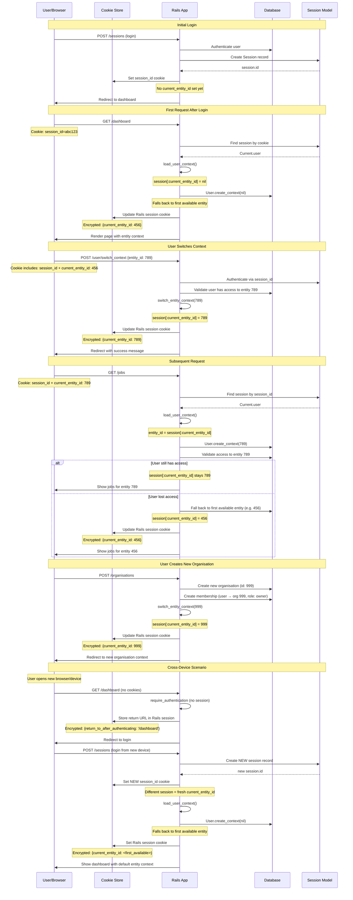

# Current Entity ID Flow Diagram

This diagram shows how `current_entity_id` is set, changed, and retrieved through user requests.

```mermaid
sequenceDiagram
    participant U as User/Browser
    participant C as Cookie Store
    participant R as Rails App
    participant DB as Database
    participant S as Session Model

    Note over U,S: Initial Login
    U->>R: POST /sessions (login)
    R->>DB: Authenticate user
    R->>S: Create Session record
    S-->>R: session.id
    R->>C: Set session_id cookie
    Note over R: No current_entity_id set yet
    R->>U: Redirect to dashboard

    Note over U,S: First Request After Login
    U->>R: GET /dashboard
    Note over U: Cookie: session_id=abc123
    R->>S: Find session by cookie
    S-->>R: Current.user
    R->>R: load_user_context()
    Note over R: session[:current_entity_id] = nil
    R->>DB: User.create_context(nil)
    Note over R: Falls back to first available entity
    R->>C: Update Rails session cookie
    Note over C: Encrypted: {current_entity_id: 456}
    R->>U: Render page with entity context

    Note over U,S: User Switches Context
    U->>R: POST /user/switch_context {entity_id: 789}
    Note over U: Cookie includes: session_id + current_entity_id: 456
    R->>S: Authenticate via session_id
    R->>DB: Validate user has access to entity 789
    R->>R: switch_entity_context(789)
    Note over R: session[:current_entity_id] = 789
    R->>C: Update Rails session cookie
    Note over C: Encrypted: {current_entity_id: 789}
    R->>U: Redirect with success message

    Note over U,S: Subsequent Request
    U->>R: GET /jobs
    Note over U: Cookie: session_id + current_entity_id: 789
    R->>S: Find session by session_id
    S-->>R: Current.user
    R->>R: load_user_context()
    Note over R: entity_id = session[:current_entity_id] # 789
    R->>DB: User.create_context(789)
    R->>DB: Validate access to entity 789
    alt User still has access
        Note over R: session[:current_entity_id] stays 789
        R->>U: Show jobs for entity 789
    else User lost access
        R->>DB: Fall back to first available entity (e.g. 456)
        Note over R: session[:current_entity_id] = 456
        R->>C: Update Rails session cookie
        Note over C: Encrypted: {current_entity_id: 456}
        R->>U: Show jobs for entity 456
    end

    Note over U,S: User Creates New Organisation
    U->>R: POST /organisations
    R->>DB: Create new organisation (id: 999)
    R->>DB: Create membership (user → org 999, role: owner)
    R->>R: switch_entity_context(999)
    Note over R: session[:current_entity_id] = 999
    R->>C: Update Rails session cookie
    Note over C: Encrypted: {current_entity_id: 999}
    R->>U: Redirect to new organisation context

    Note over U,S: Cross-Device Scenario
    Note over U: User opens new browser/device
    U->>R: GET /dashboard (no cookies)
    R->>R: require_authentication (no session)
    R->>C: Store return URL in Rails session
    Note over C: Encrypted: {return_to_after_authenticating: '/dashboard'}
    R->>U: Redirect to login

    U->>R: POST /sessions (login from new device)
    R->>S: Create NEW session record
    S-->>R: new session.id
    R->>C: Set NEW session_id cookie
    Note over R: Different session = fresh current_entity_id
    R->>R: load_user_context()
    R->>DB: User.create_context(nil)
    Note over R: Falls back to first available entity
    R->>C: Set Rails session cookie
    Note over C: Encrypted: {current_entity_id: <first_available>}
    R->>U: Show dashboard with default entity context
```